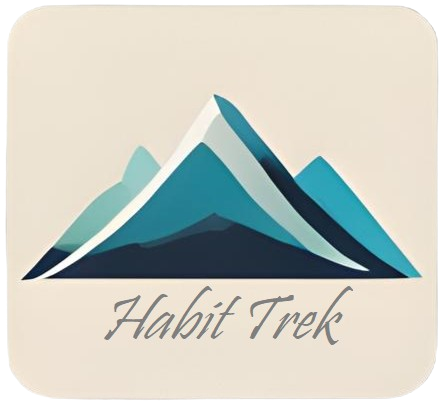
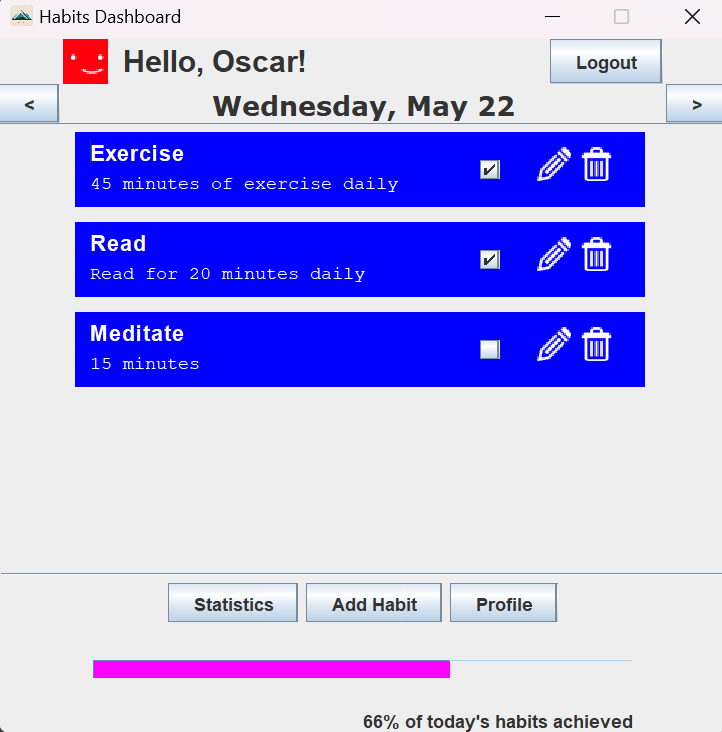
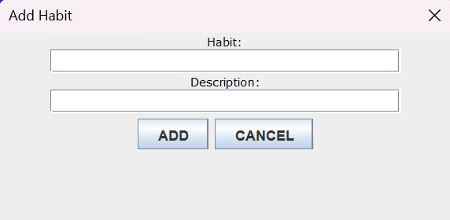
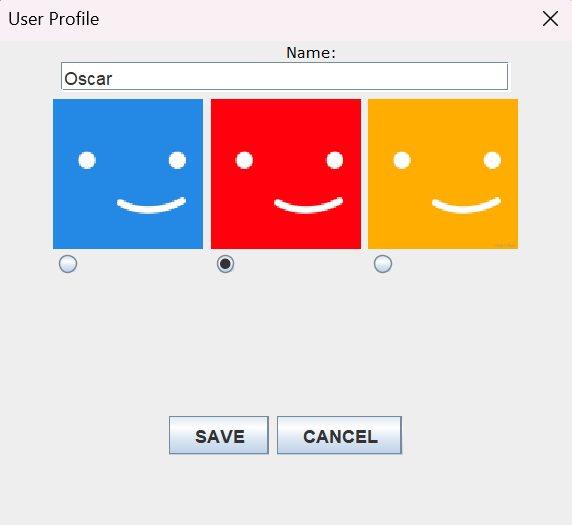
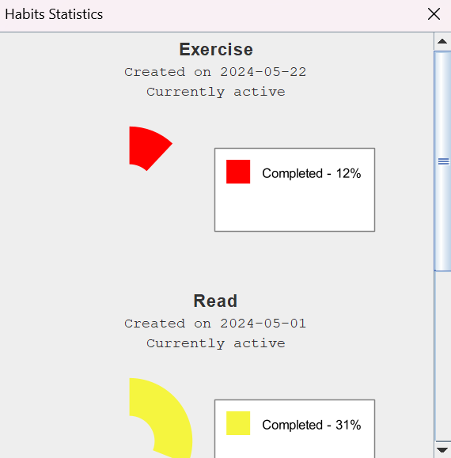

# ⛰️ Habit Trek ⛰️

#### Course Project - Agile Development Methods
#### Spring Semester 2024
#### Kristianstad University
#### Prof. Marijana Teljega

  

## Contributors

- [Katerina Arvay](https://github.com/Preia-Starle)
- [Bianca Casetta](https://github.com/biancacasetta)
- [Antoine Geiger](https://github.com/tableba)
- [Oscar Nilsson](https://github.com/OscarHNilsson)
- [Dario Ostojic](https://github.com/DarioOstojic)

---

## Introduction

Welcome to Habit Trek, a Java Swing-based habit tracker designed to help you build and maintain positive habits. This project provides an interface to create habits, track progress, and analyse your habits over time. Habit Trek aims to be your companion in achieving personal growth and productivity by offering a structured and visually appealing way to monitor your daily routines.

## Functionalities

### Main View - Dashboard

  

  

- **Overview of Habits**: Displays a summary of all your tracked habits with a daily progress indicator showing the percentage of your completed habits.
- **Daily Check-In**: Allows you to mark habits as completed for the day.
- **Add Habit**: A streamlined process to quickly add new habits to your tracker.
- **Delete Habit**: If you decide not to track a habit anymore, you are allowed to delete it from the Dashboard view (although it will remain in the database and it will be displayed in the Statistics page).
- **Edit Habit**: Once your habit is created, you can modify its title or description if you choose to, instead of deleting it and adding it again.

### User View

  

- **User Profile Management**: Manage your profile information, including username and profile picture.
- **Multiple Profiles Allowed**: You can share the application locally in your computer with other people by creating new profiles and passwords that allow you to log in. Once logged in, only the habits created during the current session are displayed.

### Statistics View

  

- **Completion Charts**: Visualise your completion rate over time with a donut chart. The date range considered for this rate goes from creation date till deletion date, if the habit was deleted, or till the current date if the habit is active.
**Colour-code**: Depending on the completion rate, the colour displayed is different (red, yellow or green), making it visually easy to know what habits you should focus on if you have not completed it frequently.
